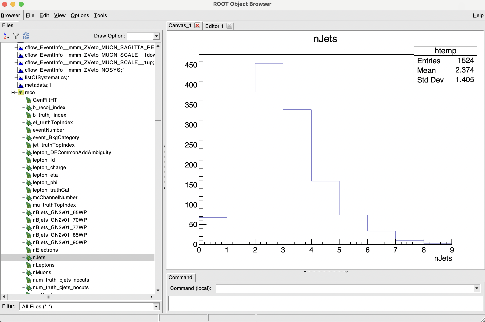

# Lecture 1

## Reading and Writing ROOT files

In this first lecture we will learn how to setup ROOT in your machine and the basics of **reading** and **writing** ROOT files. 

### Setting up ROOT

If you want to install ROOT in your machine, you can follow the instructions in the [ROOT website](https://root.cern/install/). In my experience one does not simply install ROOT in their first try, so good luck!

With access to cvmfs on one of the Lab Room machines, you can simply run the following command in the terminal to setup ROOT (this will have to be done every terminal session):

```bash
cvmfs_config probe
source /cvmfs/sft.cern.ch/lcg/app/releases/ROOT/6.28.12/x86_64-centos8-gcc85-opt/bin/thisroot.sh
which root
root
```

You can exit ROOT at all times by typing

```cpp
root[1] .q
```

### Downloading the data

We will use some pregenerated Monte Carlo events coming from ATLAS for the purpose of this tutorial. You can download this data from [here](https://my.supa.ac.uk/course/section.php?id=9237), under *Lecture1 Input File*.

This file contains some processed Monte Carlo events for **top anti-top pair production** for the latest Run3 centre of mass energy of 13.6 TeV at the LHC. 

### Viewing the contents of the file

We can view the contents of this file by running the following command ```root [options] [file]```. For example:

```bash
root -l mc23_13p6TeV.ttbar_PP8.root
```

Available options are:

| Option | Description                                      |
|--------|--------------------------------------------------|
| -l     | Start ROOT in interactive mode (no startup screen) |
| -b     | Start ROOT in batch mode (no graphics)           |
| -q     | Quit ROOT after processing the file              |
| -x     | Exit ROOT after processing the file              |

I would recommend always using the ```-l``` option to make it load up faster. In the latest versions of ROOT, specially if you install it on your own machine, there is an annoying new feature were it will always try to open a browser window whenever you draw stuff. You can disable this by opening root like ```root -l --web=off [more options] [file]```.

To list the contents of a file you can use the following command:

```cpp
root[1] _file0->ls()
```

By default, if you open the root file as before it will rename it to ```_file0```. Alternatively you can do ```root[1] .ls```, which is faster. You will see a big list of objects in the file, which are the histograms and trees that were saved in the file. Trees are saved as **TTree** objects and histograms are saved as **TH1F**, **TH1D**, **TH2F**, **TH2D**, etc. For the latter, the number at the end indicates the number of dimensions of the histogram, and the letter indicates the type of the bin content (F for float, D for double).

We are interested in exploring the contents of the TTree called ```reco```, so we can do the following:

```cpp
root[1] reco->Show(0)
```

!!! note
    From now on I will omit the ```root[1]``` header from the commands. But remember that these commands will only run in the ROOT interpreter.

You will again see a big list of **TBranches** stored in the TTree. With the command ```reco->Show(0)``` we are asking ROOT to show the contents of the first event in the TTree. If you want to see the contents of the 10th event you can do ```reco->Show(9)```.

!!! note "Other visualisation options"
    There are other ways to explore the contents of the TTree, like ```reco->Print()``` or ```reco->Scan()```. With the latter you can select which branches you want to see, for example:
    ```cpp
    reco->Scan("jet_pt_NOSYS:jet_eta:jet_phi")
    ```
    With ```Scan``` you may also fo simple arithmetic operations like
    ```cpp
    reco->Scan("jet_pt_NOSYS/1000:nElectrons+nMuons")
    ```

You may notice that some branches have a single value associated to them while others, like ```jet_pt_NOSYS```, are labelled as a ```vector<float>```. This is because the TTree is storing a collection of values for that branch. For example, the branch ```jet_pt_NOSYS``` is storing the transverse momentum of all jets in each of the events. 

#### TBrowser

Another tool for easy visualisation is the **TBrowser**. You can open it by running the following command:

```cpp
new TBrowser()
```

You will get prompted with an old-school looking window with a list of all the objects in the file. You can click on the objects to see their contents as histograms on the right panel.

??? note "TBrowser example"
    

Feel free to explore the contents of the file using the TBrowser. 

* Can you find the histograms of the variables we were scanning before? 
* Notice how ```vector<float>``` branches also show up as normal looking histograms. Can you spot the difference between them and the single value branches?

While this is a nice tool for quick visualisation, it is not very useful for more complex operations. For that we will need to write some code.

#### Writing some code in the terminal

We can ask root in the command line to draw the same histograms we were seeing in the TBrowser. This will create a new window (or TCanvas as ROOT calls it) with the histogram. The syntax is ```tree_name->Draw("branch_name", "weights*selections", "options")```. Available options for drwaing can be found in the [THistPainter ROOT Class](https://root.cern/doc/master/classTHistPainter.html). Typicalle, using "HIST E" will draw a standard histogram with error bars and the data points (it does not care about upper/lower case).

For example:

```cpp
reco->Draw("jet_pt_NOSYS/1000", "weight_mc_NOSYS", "hist"); // This will draw the jet_pt_NOSYS in GeV and with the Monte Carlo event weight applied

reco->Draw("jet_pt_NOSYS/1000[0]", "weight_mc_NOSYS", "hist e"); // This will draw the first jet in the event

reco->Draw("jet_pt_NOSYS/1000", "weight_mc_NOSYS*nJets>4", "hist e"); // This will draw the jet_pt_NOSYS histogram only for events with more than 4 jets
```

!!! note
    The ```weight_mc_NOSYS``` branch is a Monte Carlo generator specific weight that is applied to each event to quantify the probability of that event happening for a given process. This is always applied to ensure that the simulation will reproduce the data as closely as possible.  

This visualisation method is very powerful for quick checks of your root files as you can reproduce any histogram with any selection you want at the expense of working with the terminal. However, for bigger analysis you will want to write a macro.

#### Advanced used of terminal commands

As you have seen, the ```Draw()``` function outputs a decent-looking histogram, but it is not very flexible. For that you will need to use the **TH1** class directly: ```TH1F("hist_name", "Title", Nbins, xmin, xmax)``` and the ```Project()``` function. We can replicate the above diagrams using the following: 

```cpp
TH1F *h_jet_pt = new TH1F("h_jet_pt", "Jet p_{T}", 25, 0, 400); // I can now control the number and ranges of the bins in the x-axis, as well as giving my plot a title
reco->Project("h_jet_pt", "jet_pt_NOSYS/1000", "weight_mc_NOSYS"); // This is the equivalent of the Draw() function
h_jet_pt->Draw("hist"); // This will draw the histogram in a new canvas
```

At this stage one can also make the plot more fancy by adding a legend, axis labels, changing the line color and style, aspect ratio, etc. But we will dive into all of these options in the [next lecture](lecture2.md).


#### Looping over the ROOT file

For more complex calculations, for instance if you want to calculate the invariant mass of a pair of jets, or boost to a certain frame, you will need to write a macro. You may use either Pyhton or C++ for this, whatever you feel more comfortable with. You can run the **Python** code in the terminal using ```python3.11 [programName.py]``` and the **C++** code using ```root -l [programName.C]```.

Below are two example codes that do the exact same thing, but one is in Python and the other in C++. Both loop over all of the events and declare two histograms, one for the leading jet transverse momentum and another for the number of jets in the event. 

Note that none of them will produce any output since they are just internally declaring the histograms, however if you run the C++ version you will have access to the newly created histograms in the ROOT interpreter. This means you can plot them using e.g. ```h_lead_jet_pt->Draw()```.

```cpp
#include <TFile.h>
#include <TTree.h>

void programName() {
    
    // Declare a new file with the option "READ"
    TFile *f = new TFile("mc23_13p6TeV.ttbar_PP8.root", "READ");
    // Fetch the TTree called "reco" from the file
    TTree *reco = (TTree*)f->Get("reco");

    // Declare the variables that will be stored in the branches
    Int_t nJets;
    std::vector<float> *jet_pt = nullptr;

    // Link the branches to the variables SetBranchAddress("branch_name_in_tree", &variable)
    reco->SetBranchAddress("jet_pt_NOSYS", &jet_pt);
    reco->SetBranchAddress("nJets", &nJets);

    // Declare the histograms
    TH1F *h_lead_jet_pt = new TH1F("h_lead_jet_pt", "Leading jet p_{T}", 25, 0, 400);
    TH1F *h_nJets = new TH1F("h_nJets", "Number of jets", 10, 0, 10);

    // Loop over all the events in the TTree and fill the histograms
    for (Int_t i = 0; i < reco->GetEntries(); i++) {
        reco->GetEntry(i);
        h_lead_jet_pt->Fill(jet_pt->at(0)/1000);
        h_nJets->Fill(nJets);
    }
}
```


!!! note "Python version of the code"
    ```python
    import ROOT

    # Declare a new file with the option "READ"
    f = ROOT.TFile("mc23_13p6TeV.ttbar_PP8.root")
    # Fetch the TTree called "reco" from the file
    reco = f.Get("reco")

    # Declare the histograms
    h_lead_jet_pt = ROOT.TH1F("h_lead_jet_pt", "Leading jet p_{T}", 25, 0, 400)
    h_nJets = ROOT.TH1F("h_nJets", "Number of jets", 10, 0, 10)

    # Loop over all the events in the TTree and fill the histograms
    for i in range(reco.GetEntries()):
        reco.GetEntry(i)
        h_lead_jet_pt.Fill(reco.jet_pt_NOSYS[0]/1000)
        h_nJets.Fill(reco.nJets)
    ```

* Both codes have the same **bug that will throw an error**. *Can you spot it, and fix it?* 
* In addition, these examples fill the histograms while **ignoring the event weight**. *Can you add the MC event weight to the histograms?*

#### RDataFrame

The **RDataFrame** class is a new feature in ROOT that allows you to do complex operations on the TTree in a more Pythonic way. The full documentation along with more examples can be found in the [RDataFrame Class](https://root.cern/doc/v628/classROOT_1_1RDataFrame.html). For example, the following code will do the same as the previous examples, but in a more compact way:


```cpp
void programName() {
    // We select the TTree and the file at the same time
    ROOT::RDataFrame d("reco", "mc23_13p6TeV.ttbar_PP8.root"); 

    // Automatic booking of the histogram, TBranch and variable type
    auto h_nJets = d.Histo1D<int>("nJets");

    // This runs the event loop, it's equivalent to the for loop we implemented above
    h_nJets->DrawClone();
}
```

??? note "Possible crashes with ROOT"
    You may notice that when you run the code for the first time it runs smoothly, but upon running it again inside the ROOT interpreter, with ```.x programName.C``` you will get a crash. While I don't know the exact reason why this happens, I suspect it is because ROOT is trying to create the histograms again, but they already exist within the running session. You can fix this by existing ROOT and running the ```root programName.C``` again. 

!!! note "Python version of the code"
    ```python
    import ROOT

    # We select the TTree and the file at the same time
    d = ROOT.RDataFrame("reco", "mc23_13p6TeV.ttbar_PP8.root")

    # Automatic booking of the histogram and TBranch and variable type
    h_nJets = d.Histo1D("nJets")

    # This runs the event loop, it's equivalent to the for loop we implemented above
    h_nJets.DrawClone()
    ```

### Writing to a ROOT file

Now that we have explored the contents of the file, we can write some new histograms, trees and branches to a new root file. This is very useful if you want to save the results of your analysis for later use. We will make use of the ```TObject::Write``` method and ```TFile("[filename]", "[option]")``` class with the following options:

| Option | Description                                      |
|--------|--------------------------------------------------|
| READ   | Open the file for reading                        |
| RECREATE | Create a new file, if it already exists it will be overwritten |
| UPDATE | Open the file for reading and writing            |
| CREATE    | Create a new file, if it already exists it will throw an error |


```cpp
#include <TFile.h>
#include <TTree.h>

void programName() {

    // Declare a new file with the option "RECREATE"
    TFile *f = new TFile("out.root", "RECREATE");
    // Declare a new tree with the name "tree" and the title "Example Tree"
    TTree *tree = new TTree("tree", "Example Tree");

    // Declare a float variable "poisson"
    float poisson;
    // Declare a histogram with the name "h", the title "Poisson", 10 bins from 0 to 10
    TH1F *h = new TH1F("h", "Poisson", 10, 0, 10);

    // Book the branch "branch_poisson" to the tree and link it to the variable "poisson", you can also specify the variable type
    tree->Branch("branch_poisson", &poisson, "poisson/F");

    for (Int_t i = 0; i < 1000; i++) {
        // For each 'event', fill the variable 'poisson' with a Poisson distribution with mean 5
        poisson = gRandom->Poisson(5);
        // Fill the histogram with the value of 'poisson'
        h->Fill(poisson);
        // Fill al the branches of the tree
        tree->Fill();
    }

    // Write the histogram and the tree to the file
    h->Write();
    tree->Write();

    // Close the file
    f->Close();

}
```

!!! note "Python version of the code"
    ```python
    import ROOT
    from array import array

    # Declare a new file with the option "RECREATE"
    f = ROOT.TFile("out.root", "RECREATE")
    # Declare a new tree with the name "tree" and the title "Example Tree"
    tree = ROOT.TTree("tree", "Example Tree")

    # Declare a 1D float array to store the variable "poisson"
    poisson = array('f', [0])
    # Declare a histogram with the name "h", the title "Poisson", 10 bins from 0 to 10
    h = ROOT.TH1F("h", "Poisson", 10, 0, 10)

    # Book the branch "branch_poisson" to the tree and link it to the variable "poisson", you can also specify the variable type
    tree.Branch("branch_poisson", poisson, "poisson/F")

    for i in range(1000):
        # For each 'event', fill the variable 'poisson' with a Poisson distribution with mean 5
        poisson[0] = ROOT.gRandom.Poisson(5)
        # Fill the histogram with the value of 'poisson'
        h.Fill(poisson[0])
        # Fill all the branches of the tree
        tree.Fill()

    # Write the histogram and the tree to the file
    h.Write()
    tree.Write()

    # Close the file
    f.Close()
    ```

??? note "Overwriting TObjects"
    Sometimes ROOT does not want to cooperate when rewriting existing trees or histagrams, you can force this to happen by calling the ```TObject::Write``` method with the option ```kOverwrite```. For example:
    ```cpp
    tree->Write("", TObject::kOverwrite);
    ```

You can now inspect the new root file with the methods we have learned before. 

* Notice how branches will always be saved inside the TTree, while the histogram is stored as a separate object in the file. 
* Check out how the same data is represented in the TH1F histogram and the TBranch. Which method do you prefer? Which one is more flexible?
* We have seen how vectors are very commonly used as well. Can you modify the code to save a ```vector<float>``` branch that contains a Poisson distribution with mean=1 in the first element, mean=2 in the second, and so on?

??? note "Vector Solution SPOILER!"
    ```cpp
    std::vector<float> poisson_vector;
    tree->Branch("branch_poisson_vector", &poisson_vector);
    for (Int_t i = 0; i < 1000; i++) {
        // For each 'event', we first clear the vector
        poisson_vector.clear();
        for (Int_t j = 0; j < 10; j++) {
            // We use the push_back method to each of the elements to the vector
            poisson_vector.push_back(gRandom->Poisson(j+1));
        }
        tree->Fill();
    }
    ```

This concludes the first lecture. In the next one we will learn how to make more complex plots, how to fit functions to histograms, and how to make your plots look more professional. Below is an exercise that will put to test all the knowledge you have acquired in this lecture.

## Exercise 1

1. Write a macro that reads the file ```mc23_13p6TeV.ttbar_PP8.root``` and saves *at least* the following branches to a new root file called ```ttbar_PP8_analysis.root```:
    * The jet transverse momentum (```vector<float> jet_pt_NOSYS```)
    * The lepton transverse momentum (```vector<float> lepton_pt_NOSYS```)
    * The lepton pseudorapidity (```vector<float> lepton_eta```)
    * The lepton azimuthal angle (```vector<float> lepton_phi```)
    * The lepton energy (```vector<float> lepton_e_NOSYS```)    
    * The number of jets in the event (```int nJets```)
    * The number of leptons in the event (```int nLeptons```)
    * The number of b-jets in the event (```int nBjets_GN2v01_77WP```)
    * The event Monte Carlo weight (```float weight_mc_NOSYS```)
    ??? note "*Advanced* Hint"
        Look up the ```TTree::CloneTree()``` and ```TTree::SetBranchStatus()``` methods in the ROOT documentation to make your code smarter and faster.
1. From the new root file: 
    * What are the average values for the number of jets, b-jets and leptons in the sample? This is a ttbar NLO sample, where both tops decay leptonically (e.g. t->Wb->lνb), do the values you see make sense?
    * Make a histogram of the leading and sub-leading jet transverse momentum for events with at least 3 jets and at least 1 b-jet. Remember that events in a histogram should be weighted using the Monte Carlo weight. Save it to the same root file.
    * Make another histogram of the leading lepton transverse momentum for events with at least 2 leptons, at least 1 b-jet and save it.
1. Construct the lepton's four-momentum vectors and calculate the invariant mass of the lepton pair. Make a histogram of the invariant mass for events with exactly 2 leptons and at least 1 b-jet. Save it to the same root file.
??? note "Hint"
    Look up the ```TLorentzVector``` class in the ROOT documentation.     

