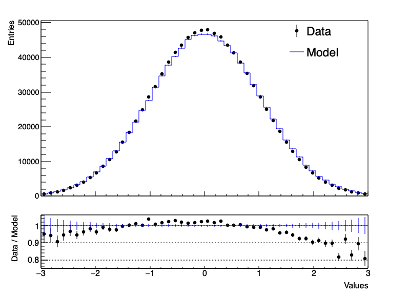
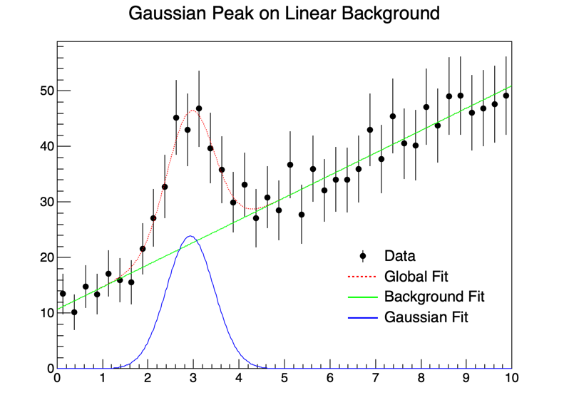

#Lecture 2

## Plotting in ROOT

In the previous lecture we have seen how to create a histogram in ROOT. Now we will see how you can modify it a plot it in different ways. Any time you called the ```Draw()``` method a new window popped up with the histogram. Internally ROOT was creating a **TCanvas** to draw the histogram. It is more convenient to define the canvas yourself as it allows for more flexibility and the ability to save your histograms as files. Inside a canvas you can have multiple pads, which are the areas where you can draw your histograms, graphs, etc. Below is an example of how to create a canvas with a single (default) pad and draw a histogram in it.

```cpp
{
    TH1::SetDefaultSumw2(); // Setting the sum of squares of weights to be stored in the histogram

    // Declaring the TCanvas("[canvas identifier]", "[name of canvas]",  width, height)
    TCanvas *c1 = new TCanvas("c1","c1",800,600); 
    TH1D *hist = new TH1D("hist","hist",20,-3,3);

    // Filling and Drawing the histogram with a random gaussian distribution centered at 0 with a sigma of 1
    hist->FillRandom("gaus",1000);

    // Selecting the canvas, this is not necessary if you have only one pad/canvas but it is good practice
    c1->cd(); 

    // Drawing the histogram
    hist->Draw(); 

    // Updating the canvas, this is not necessary but can solve problems sometimes
    c1->Update(); 
    
    // Saving the canvas as a .png file 
    c1->SaveAs("histogram.png"); 
}
```

### Decorating the Plot

We can further decorate the plot, we can add a [TLegend class](https://root.cern.ch/doc/master/classTLegend.html), change the axis labels, the title, the line color, the fill color, etc (more stuff in [THistPainter class](https://root.cern/doc/v628/classTHistPainter.html)). Below is an example of how to do this.

```cpp
{
    // [previous code]

    // Drawing the histogram
    hist->Draw("hist e1"); 

    // Adding a legend, declaring the (x,y) position in the canvas TLegend(x1,y1,x2,y2)
    TLegend *legend = new TLegend(0.1,0.7,0.48,0.9);

    // Entries can be added with the AddEntry([hisotgram identifier], "[name]", "[line type]") method, linking it the histogram
    legend->AddEntry(hist,"Gaussian Distribution","l");

    // Make a transparent and borderless legend, looks better
    legend->SetFillStyle(0);
    legend->SetBorderSize(0);
    legend->Draw();

    // Changing the axis labels
    hist->GetXaxis()->SetTitle("Values");
    hist->GetYaxis()->SetTitle("Frequency");

    // Changing the title
    hist->SetTitle("Gaussian Distribution");

    // Changing the line color
    hist->SetLineColor(kRed);

    // Changing the fill color, the second argument is the transparency
    hist->SetFillColorAlpha(kOrange);

    // Updating the canvas, this is not necessary but can solve problems sometimes
    c1->Update(); 

    // Saving the canvas as a .png file 
    c1->SaveAs("histogram.png");  
}
```
### Setting the Style

By default ROOT creates a default style that can be accessed via the member of the [TStyle class](https://root.cern.ch/doc/master/classTStyle.html), the gStyle pointer, which has access to the currently active style. This class includes functions to set canvases, pads, lines, markers, axes, etc. You can play around with the built-in ones by setting

```cpp
// Available values: Classic, Plain, Bold, Video, Pub, Modern (default), ATLAS, BELLE2
gROOT->SetStyle("[style name]");
```

You may also create your onw style and then load it up in your macros. If you come up with something you really like you can save this style as a separate macro and call it from any other macro you create to keep consistency. Here is an example of how you would do this:

```cpp
{
    // Creating a new style
    TStyle *myStyle = new TStyle("myStyle","My Style");

    myStyle->SetCanvasColor(0); 
    myStyle->SetPadColor(0); 
    myStyle->SetLineWidth(2);
    myStyle->SetPadTopMargin(0.8);

    // [and many more options]

    gROOT->SetStyle("myStyle");
}
```

### Ratio Panels

When comparing two histograms, adding a ratio plot is sometimes *essential* to spot problems. If you are comparing real data to simulated one (which is usually always the case in particle physics) they are very useful to spot modelling issues. Below is an example of how to do this:

```cpp
{
    TH1::SetDefaultSumw2(); // Setting the sum of squares of weights to be stored in the histogram

    gStyle->SetOptStat(0); // Setting the statistics box to be off by default
    gStyle->SetOptTitle(0); // Setting the title box to be off by default

    // Declaring the TCanvas("[canvas identifier]", "[name of canvas]",  width, height)
    TCanvas *c1 = new TCanvas("c1","c1",800,600);

    // Declare both pads with TPad("[pad identifier]", "[name of pad]", x1, y1, x2, y2)
    TPad *up = new TPad("up", "up", 0, 0.3, 1, 1); 
    TPad *low = new TPad("low", "low", 0, 0, 1, 0.3);

    // Declare the histograms
    TH1D *h_model = new TH1D("h_model", "Theory Model", 50, -3, 3); 
    TH1D *h_data = new TH1D("h_data", "Observed Data", 50, -3, 3); 

    // Random number generator
    TRandom3 *rand = new TRandom3(); 

    // Fill the histograms with slightly different Gaussian distributions
    for (int i = 0; i < 1000000; i++) {
        h_data->Fill(rand->Gaus(0, 1));
        h_model->Fill(0.85*rand->Gaus(0.02, 1.2));
    }

    // Draw both pads
    c1->cd();
    up->Draw();
    low->Draw();

    // Move the the upper pad and change the bottom margin
    up->cd();
    up->SetBottomMargin(0.05);

    // Draw the histograms and modify the style
    h_data->Draw("hist p e x0");
    h_data->SetMarkerStyle(20);
    h_data->SetMarkerSize(0.7);
    h_data->SetMarkerColor(kBlack);
    h_data->SetLineColor(kBlack);
    h_data->GetYaxis()->SetTitle("Entries");
    h_data->GetYaxis()->SetTitleSize(0.045);
    h_data->GetYaxis()->SetTitleOffset(1);
    h_data->GetYaxis()->SetLabelSize(0.04);
    h_data->GetXaxis()->SetLabelSize(0);

    h_model->Draw("hist same e");
    h_model->SetLineColor(kBlue);

    // Add a legend
    TLegend *leg = new TLegend(0.7, 0.7, 0.9, 0.9);
    leg->AddEntry(h_data, "Data", "p e");
    leg->AddEntry(h_model, "Model", "l");
    leg->Draw();
    leg->SetBorderSize(0);
    leg->SetFillStyle(0);

    // Move to the lower pad, set the grid and margins
    low->cd();
    low->SetGridy();
    low->SetBottomMargin(0.3);

    // Create a ratio histogram, this is done by dividing the data by the model
    TH1D *h_ratio = (TH1D*)h_data->Clone("h_ratio");
    h_ratio->Divide(h_model);

    // Draw the histograms and customise the style
    h_ratio->Draw("hist p e x0");
    h_ratio->SetMarkerStyle(20);
    h_ratio->SetMarkerSize(0.7);
    h_ratio->GetYaxis()->SetNdivisions(505);
    h_ratio->GetYaxis()->SetLabelSize(0.1);
    h_ratio->GetYaxis()->SetTitle("Data / Model");
    h_ratio->GetYaxis()->SetTitleOffset(0.4);
    h_ratio->GetYaxis()->SetTitleSize(0.1);

    h_ratio->GetXaxis()->SetLabelSize(0.1);
    h_ratio->GetXaxis()->SetTitle("Values");
    h_ratio->GetXaxis()->SetTitleOffset(1.2);
    h_ratio->GetXaxis()->SetTitleSize(0.1);

    // Divide the model histogram by itself to create a line at 1 with correct errors
    TH1D *h_ratio_one = (TH1D*)h_model->Clone("h_ratio_one");
    h_ratio_one->Divide(h_model);
    h_ratio_one->Draw("hist same e");

    // Update the canvas and save the plot
    c1->Update();
    c1->SaveAs("ratio.png");
}
```



As you can appreciate most of the code deals with setting the correct label and axis title sizes/offset to make the plot readable, this is a very *annoying* part of ROOT. You can access the 'default' values of your plot by calling one of the ```Get()``` methods, i.e. ```histogram->GetYaxis()->GetTitleSize()```, and then modify it accordingly. But most of the time it's a bit of guess work.

You can also use the [TRatioPlot class](https://root.cern.ch/doc/master/classTRatioPlot.html) which can avoid all this hassle and automatically create the ratio plot for you. The default output from this class is a bit ugly and it seems to take over any style you have selected in you main pad, but it is much faster and easier to use for quick comparisons.

```cpp
{
    // [previous code]

    // Create the ratio plot
    TRatioPlot *rp = new TRatioPlot(h_data, h_model);
    rp->Draw();

    // Update the canvas and save the plot
    c1->Update();
    c1->SaveAs("ratio.png");
}
```

### Other types of plots

#### TProfile

A profile histogram is a histogram that contains the mean value of the Y variable for each bin in X. It is useful when you have a large number of points in a bin and you want to see the mean value of the Y variable. This video explains it very well with a simple example: [TProfile tutorial](https://www.youtube.com/watch?v=-VMcNp2R-V8). TProfile has also access to all TH1 options for plotting and setting the style.

#### TGraph and TGraphErrors

These types of plots are your standard line graphs with uncertainties. They are very useful when you can't draw your functions properly with TH1 or you have a set of points you want to plot. You can read more about the in the [TGraph class](https://root.cern.ch/doc/master/classTGraph.html), [TGraphErrors class](https://root.cern.ch/doc/master/classTGraphErrors.html) and also [TGraphAsymmErrors class](https://root.cern.ch/doc/master/classTGraphAsymmErrors.html) for asymmetric errors.

In particle physics they are not as common and typically histograms are treated as if they were graphs, but they can be the better choice in other cases. To achieve this, one can use the ```TH1::SetBinConent()``` method to set the y values and the ```TH1::SetBinError()``` method to set the uncertainties. 

Below is an example of how you can plot a TGraph of a Gaussian function with a background slope:

```cpp
{
    // Declaring the TCanvas("[canvas identifier]", "[name of canvas]",  width, height)
    TCanvas *c1 = new TCanvas("c1","c1",800,600);

    TF1 *func = new TF1("func", "gaus + [3]*x", 0, 10); // Declaring the function to be plotted

    // Set the parameters of the Gaussian(3)
    func->SetParameter(0, 1); // Amplitude
    func->SetParameter(1, 5); // Mean
    func->SetParameter(2, 1); // Standard deviation

    // Set the parameters of the linear function
    func->SetParameter(3, 0.1); // Slope

    // Declaring the graph to be plotted
    TGraph *graph = new TGraph(); 

    // Filling the graph with the function values
    for (int i = 0; i < 50; i++) {
        graph->SetPoint(i, i/5., func->Eval(i/5.));
    }

    // Drawing the graph
    graph->Draw("AP"); 
    graph->SetMarkerStyle(20);
}
```

A couple of notes on this code:

* ```TGraph()``` has many constructors, you can define it with a set number of points ```TGraph(int n)```, with a set of x and y values ```TGraph(int n, vector x, vector y)```, or even empty as shown here and then fill it up later. The latter allows for more flexibility if your dataset size is unknown.
* The above code can also be done by just plotting the function directly with ```func->Draw()```, but this is a simple example to show how to use TGraph.
* Perhaps a more common use of TGraph is to read arrays of numbers for x and y values, along with their uncertainties and plot them; there are plenty of examples online on how to do this.


### Fitting in ROOT

Fitting custom functions in ROOT is done with a combination of the [TF1 class](https://root.cern.ch/doc/master/classTF1.html) and the [TH1::Fit()](https://root.cern.ch/root/htmldoc/guides/users-guide/FittingHistograms.html) method. The following code will attempt to fit and extract the Gaussian parameters of an analogous function to the one we defined in the ```TGraph``` example.

??? note "This is a long one"
    ```cpp
    #include <TH1.h>
    #include <TF1.h>
    #include <TCanvas.h>

    // We can define two separate functions to account for the background and the signal Gaussian peak
    Double_t background(Double_t *x, Double_t *par) {
        return par[0] + par[1]*x[0];
    }

    Double_t gaussian(Double_t *x, Double_t *par) {
        return par[0]*TMath::Gaus(x[0], par[1], par[2]);
    }

    // Then we can add them together to get the full function
    Double_t fitFunction(Double_t *x, Double_t *par) {
        return background(x, par) + gaussian(x, &par[2]);
    }

    void gaussian_fit() 
    {
        gStyle->SetOptStat(0); // Setting the statistics box to be off by default

        // Declaring the TCanvas("[canvas identifier]", "[name of canvas]",  width, height)
        TCanvas *c1 = new TCanvas("c1","c1",800,600);

        // We will first generate some plausible looking data to fit according to the function we defined
        TF1 *func_data = new TF1("func", fitFunction, 0, 10, 5); 

        func_data->SetParameter(0, 10); // Intercept
        func_data->SetParameter(1, 4); // Slope
        func_data->SetParameter(2, 25); // Amplitude
        func_data->SetParameter(3, 3); // Mean
        func_data->SetParameter(4, 0.6); // Standard deviation

        TRandom3 *rand = new TRandom3();

        TH1D *hist = new TH1D("hist", "Gaussian Peak on Linear Background", 40, 0, 10);

        for (int i = 0; i < 40; i++) {
            double center = hist->GetBinCenter(i+1);
            // To add a bit of randomness we will add some aritficical noise to the data
            double content = func_data->Eval(center) + rand->Gaus(0, 3);
            hist->SetBinContent(i+1, content);
            hist->SetBinError(i+1, TMath::Sqrt(content));
        }

        // Drawing the graph
        hist->Draw("hist p e x0"); 
        hist->SetLineColor(kBlack);
        hist->SetMarkerStyle(20);
        hist->SetMinimum(0);

        // To make it completely decoupled, we create another function to fit the data
        TF1 *func = new TF1("func", fitFunction, 0, 10, 5);

        // We set an initial guess for the parameters
        func->SetParameters(1, 1, 1, 1, 1);

        // Fit parameters to the data will be stored in the array par
        Double_t par[5];

        // We perform the fit and apply some style options
        hist->Fit("func");
        func->Draw("same");
        func->GetParameters(par);
        func->SetLineColor(kRed);
        func->SetLineStyle(2);
        func->SetNpx(500);

        // While the funciton fits both signal and background together, we can decouple those to make the visualisation of the fit better
        TF1 *bckg = new TF1("bckg", background, 0, 10, 2);
        TF1 *gaus = new TF1("gaus", gaussian, 0, 10, 3);

        // We input the fit parameters to the background function and just plot it
        bckg->SetParameters(par);
        bckg->Draw("same");
        bckg->SetLineColor(kGreen);
        bckg->SetNpx(500);

        // Same for the Gaussian peak
        gaus->SetParameters(&par[2]);
        gaus->Draw("same");
        gaus->SetLineColor(kBlue);
        gaus->SetNpx(500);

        // We finalise the plot by addding a legend
        TLegend *leg = new TLegend(0.6, 0.2, 0.9, 0.4);
        leg->SetFillStyle(0);
        leg->SetBorderSize(0);
        leg->AddEntry(hist, "Data", "ep");
        leg->AddEntry(func, "Global Fit", "l");
        leg->AddEntry(bckg, "Background Fit", "l");
        leg->AddEntry(gaus, "Gaussian Fit", "l");
        leg->Draw();

        // Some prints of the Gaussian peak parameters
        cout << "Amplitude: " << par[2] << endl;
        cout << "Mean: " << par[3] << endl;
        cout << "Sigma: " << par[4] << endl;

        c1->Update();
        c1->SaveAs("Gaussian_fit.png");
    }
    ```

    

You can see how the final fit results agree quite well with the initial parameters we used to generate the data. The background and the Gaussian peak are also well separated and can be visualised separately. This is a very common practice in particle physics where you have a signal peak on top of a background distribution.

## Exercise 2

The necessary files for the exercise are here: [Exercise 2](https://www.ppe.gla.ac.uk/~dspiteri/SUPAROO/Exercise2/), courtesy of last years lecturer: Dr. Dwayne Spiteri.

We’re going to perform a search for the Higgs via it’s subsequent decay into a pair of photons $(H \rightarrow \gamma\gamma)$. It has a tiny branching ratio but a distinctive signature due to the two photons having good energy resolution.

```PsuedoData_Histogram_100fb.root``` is the data that was measured corresponding to 100fb$^{−1}$.

```Signal_1fb.root``` and ```Background_1fb.root``` are the signal and background simulations corresponding to 1fb$^{−1}$. The TTrees in the simulation files contain two variables: diphoton invariant mass (invariant-Mass) and the event weight (eventWeight).

Your task is to:

1. Plot the data:
    1. Plot the TH1D histogram called signal in the (Psuedo-)data file (*1st canvas*)
1. Plot the background simulation
    1. Create histogram of invariant-Mass weighted by the eventWeight. *2nd canvas*
    1. Scale simulation to match luminosity of the data. *Hint: looks at the file names*
    1. Perform a fit on the background model, there are many default functions in ROOT that you can try. Which one do you think is the best? Which metric can you use to determine this?
1. Background-only hypothesis test
    1. Plot the data and background on the same plot (*3rd canvas*)
    1. Plot the difference between data and background in a subplot
1. Finalise the plot
    1. Add the signal to that of the background (*can be done in the same canvas as the previous step*)
    1. Make the plot look pretty like you want to put it on a mug or your fridge.